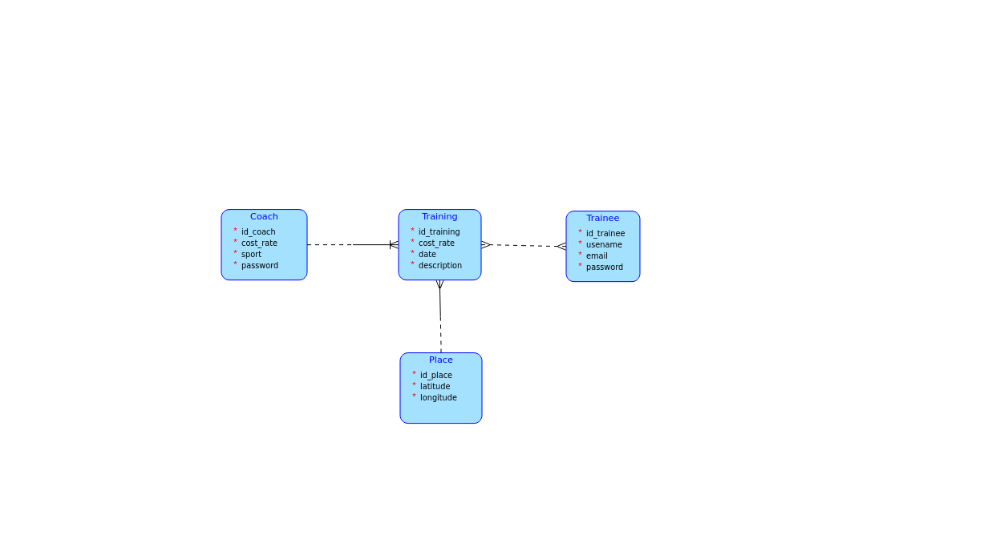

# BI-TJV-semestral

## Description
Simple reservation system for coaches and their trainees. A coach can set his operating hours and pick a place, a trainee can book coaches offered term.
## Business operations
- User(trainee) can place a request for a trraining in a selected time frame. On the server side a decision is needed oo be made and therefore it selects an available coach in the specific time frame, assign them and block out the time in their calendar, furthermore after a succescfull assignment, credits will be deducted from trainees credit account and assigned the coach after the supposed training.
- Creation of coaches new operating time segment.
- Booking a training with a coach.
- Both coach and trainee can delete a planned training.
- Coach can alter the cost rate of each training.
## More complex query
Trainees will eventually want to compare their skills to others, therefore a matchamaking based on their user profiles - that get a skill rating from each coach after every training, the server will pick them a formidable foe to slay on the court of their favourite sport. The server implements a system that helps the Users agree on a viable time and place of their match via a series of querries such as, "When do you have some spare time?", After each match the users will get some points to the rating system and report their match analysis to their current coach.
## Details
- multiple trainees can attend a single training

## Database

